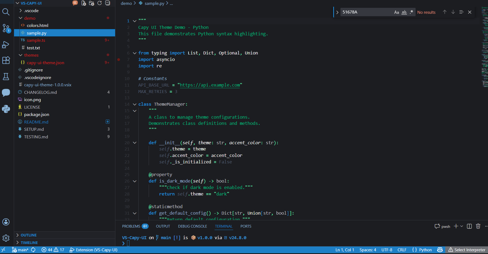

# Capy UI Theme 🦫

A dark VS Code theme with electric blue accents, inspired by the Mastodon Capy UI aesthetic.




## 🎨 Color Palette

- **Primary Accent**: `#1e80c7` - Electric blue for selections, links, and active elements
- **Background**: `#1c1d21` - Dark charcoal for comfortable long coding sessions
- **Secondary BG**: `#36383f` - Slightly lighter for subtle contrast
- **Muted Blue**: `#8bb4d8` - For comments and secondary text
- **Light Text**: `#f7f9f9` - Almost white for primary content
- **Success Green**: `#00ba7c` - For strings and success states
- **Error Red**: `#e74c3c` - For errors and deletions
- **Bright Teal**: `#5FF4AEFF` - For symbols, punctuation, and operators
- **Grey-Blue**: `#93abd0` - For functions, numbers, and constants
- **Light Grey-Blue**: `#a8b9ca` - For classes and types

## ✨ Features

- **Dominant Electric Blue**: The signature `#1e80c7` color is used throughout for selections, active tabs, buttons, and links
- **Comfortable Dark Background**: Easy on the eyes for extended coding sessions
- **Syntax Highlighting**: Carefully crafted blue-centric palette with excellent readability
- **Accessible Contrast**: Good contrast ratios for accessibility
- **Complete Coverage**: Both UI colors and comprehensive syntax token colors
- **Git Integration**: Clear diff and decoration colors
- **Terminal Theming**: Colors integrated terminal background, text, and ANSI colors (your shell prompt styling from Starship, Oh My Zsh, etc. remains separate)

## 🚀 Installation

### From VS Code Marketplace

1. Open VS Code
2. Go to Extensions (Ctrl+Shift+X / Cmd+Shift+X)
3. Search for "Capy UI Theme"
4. Click Install
5. Select the theme: `Ctrl+K Ctrl+T` → "Capy UI"

**Or install directly**: [View on Marketplace](https://marketplace.visualstudio.com/items?itemName=PatrickBoyd.capy-ui-theme)

### From Source (for development)

```bash
cd VS-Capy-UI
code --install-extension .
```

## 🖼️ Screenshots

### Editor View

The main editing experience with electric blue accents and comfortable dark background.

### Sidebar & Activity Bar

Clean interface with blue highlights for active items.

### Terminal

Fully themed terminal with the Capy UI color palette.

## 🎯 Design Philosophy

1. **Dark & Comfortable**: The `#1c1d21` background provides a comfortable environment for long coding sessions
2. **Electric Blue Dominance**: `#1e80c7` is the star - used for all interactive and focused elements
3. **Blue-Centric Syntax**: While maintaining readability, the syntax highlighting embraces blue tones
4. **Subtle UI**: Interface elements are present but don't overpower your code
5. **Accessibility**: Contrast ratios chosen with readability in mind

## 🦫 About

This theme is inspired by the Mastodon Capy UI project (and othe r Capy UI themes), bringing the same comfortable dark themed, blue-accented aesthetic to your code editor. Designed to be kinbder to your eyes for long coding sessions.

## 🛠️ Customization

You can customize any color in your `settings.json`:

```json
{
  "workbench.colorCustomizations": {
    "[Capy UI]": {
      "editor.background": "#1c1d21"
    }
  },
  "editor.tokenColorCustomizations": {
    "[Capy UI]": {
      "comments": "#8bb4d8"
    }
  }
}
```

## 📝 Feedback

Found an issue or have a suggestion? Reach out on Mastodon: [@ppb1701@ppb.social](https://ppb.social/@ppb1701)

## 📜 License

MIT License - feel free to use and modify as you wish.

---

Made with 💙 by capybara enthusiasts, for developers who appreciate good design.
